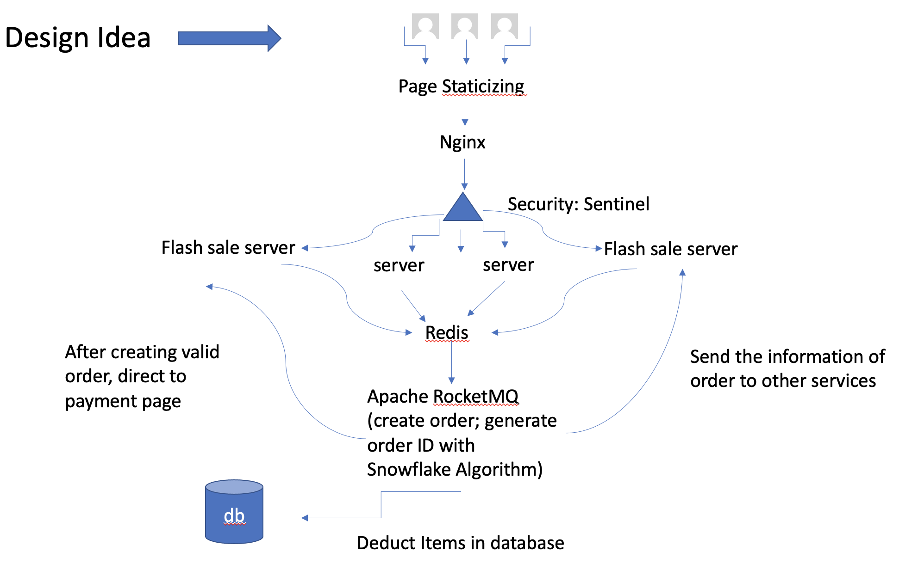
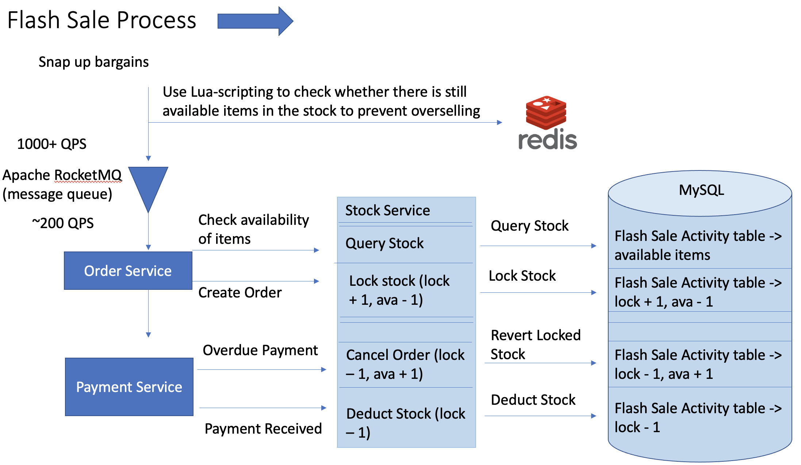

# Flash Sale Web App

## General
• Developed the flash sale web app with high concurrency and high availability by using Java Spring Boot

• Utilized Redis as the cache middleware and Lua Scripting to reduce the query frequency of MySQL database,
prevent overselling, and avoid cache blanks at the beginning of the event

• Utilized RocketMQ as the message queue to implement peak-load shifting in processing large traffic

• Utilized Jmeter to get around 990 requests/s throughput and 0% errors in the scenario of concurrent 500,000
requests in a single machine

## Design Illustration

## Flash Sale Process Illustration

